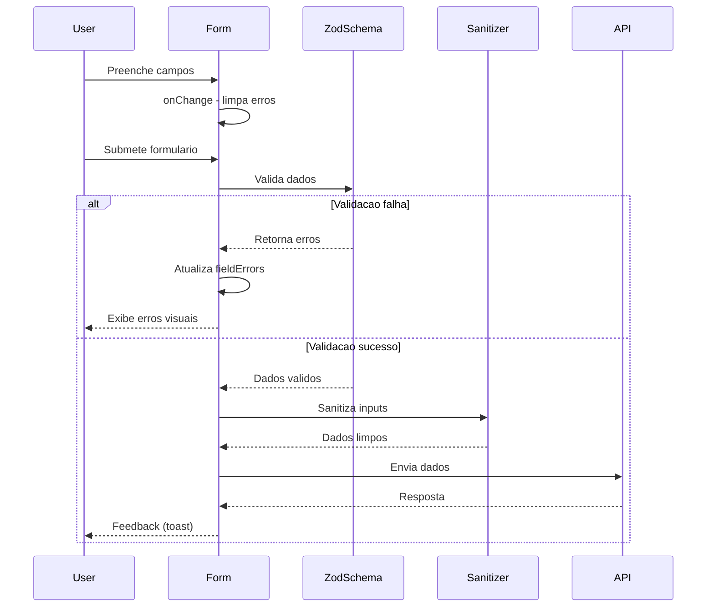
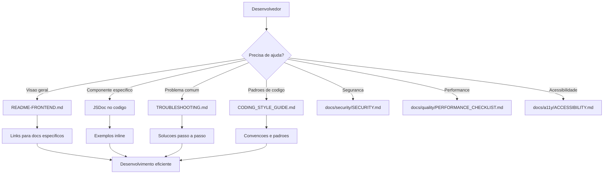

# Materia Virtualis - Frontend

Sistema de Assistente Legislativo com IA para auxílio na criação de matérias legislativas.

## 🎯 Funcionalidades Implementadas

### ✅ Core Features
- **Dashboard Principal** - Visão geral com métricas, ações rápidas e atividades recentes
- **Chatbot IA** - Interface conversacional com DeepSeek para dúvidas legislativas
- **Matérias Legislativas** - Sistema completo de gestão (criar, listar, editar)
- **Biblioteca Jurídica** - Busca semântica inteligente em 3.140 documentos
- **Sistema de Temas** - Alternância Light/Dark com persistência
- **Autenticação** - Sistema de login e gestão de usuários
- **Sidebar Navegacional** - Menu completo com 7 seções principais
- **Responsividade** - Design mobile-first totalmente responsivo

### 🎨 Design System
- Cores da marca Virtualis (#1669B6, #2A89D1, #2F95CF, #49CFEA)
- Componentes reutilizáveis (Button, Card, Input, Badge, Loading)
- Animações suaves e transições
- Tema claro e escuro
- Tipografia Inter + JetBrains Mono

## 🚀 Como Executar

### Instalação
```bash
cd frontend
npm install
```

### Desenvolvimento
```bash
npm run dev
```
Acesse: http://localhost:3000

### Build de Produção
```bash
npm run build
npm start
```

### Exportação Estática (Cloudflare Pages)
```bash
npm run build:static
```

## 📁 Estrutura do Projeto

```
frontend/
├── pages/                      # Páginas Next.js
│   ├── index.tsx              # Dashboard principal
│   ├── chatbot.tsx            # Interface do chatbot
│   ├── biblioteca.tsx         # Biblioteca jurídica
│   ├── materias/
│   │   ├── index.tsx          # Lista de matérias
│   │   └── criar.tsx          # Criar matéria
│   ├── auth/
│   │   └── callback.tsx       # SSO callback
│   ├── _app.tsx               # App wrapper
│   └── _document.tsx          # Document config
│
├── src/
│   ├── components/
│   │   ├── layout/            # Layout components
│   │   │   ├── Sidebar.tsx
│   │   │   ├── Header.tsx
│   │   │   └── MainLayout.tsx
│   │   ├── ui/                # UI components
│   │   │   ├── Button.tsx
│   │   │   ├── Card.tsx
│   │   │   ├── Input.tsx
│   │   │   ├── Badge.tsx
│   │   │   └── Loading.tsx
│   │   └── common/            # Common components
│   │       └── Logo.tsx
│   │
│   ├── hooks/                 # Custom hooks
│   │   ├── useAuth.ts
│   │   ├── useTheme.ts
│   │   └── useLocalStorage.ts
│   │
│   ├── lib/                   # Utilities
│   │   ├── api.ts             # API client
│   │   ├── utils.ts           # Helper functions
│   │   └── constants.ts       # Constants
│   │
│   ├── types/                 # TypeScript types
│   │   ├── auth.ts
│   │   └── api.ts
│   │
│   └── styles/
│       └── globals.css        # Global styles
│
├── public/                    # Static assets
│   └── logo/
│       └── imagotipo.png
│
├── tailwind.config.js         # Tailwind config
├── next.config.js             # Next.js config
└── package.json
```

## 🎨 Componentes Principais

### MainLayout
Layout principal com Sidebar e Header. Usado em todas as páginas autenticadas.

```tsx
import { MainLayout } from '@/components/layout/MainLayout'

export default function MyPage() {
  return (
    <MainLayout>
      {/* Seu conteúdo aqui */}
    </MainLayout>
  )
}
```

### Componentes UI
```tsx
import { Button } from '@/components/ui/Button'
import { Card, CardHeader, CardTitle, CardContent } from '@/components/ui/Card'
import { Input } from '@/components/ui/Input'
import { Badge } from '@/components/ui/Badge'
import { Loading } from '@/components/ui/Loading'
```

### Hooks Customizados
```tsx
import { useAuth } from '@/hooks/useAuth'
import { useTheme } from '@/hooks/useTheme'

const { user, login, logout } = useAuth()
const { theme, toggleTheme } = useTheme()
```

## 🧩 Exemplos de Uso Avançados

### Formulario completo com validacao Zod
```tsx
import { useState } from 'react'
import { materiaCreateSchema, getZodErrors, sanitizeFormData } from '@/lib/validation'
import { z } from 'zod'
import { materiasService, ApiError } from '@/lib/api'

const [formData, setFormData] = useState({ tipo: '', ementa: '' })
const [fieldErrors, setFieldErrors] = useState<Record<string, string>>({})

const handleSubmit = async () => {
  try {
    materiaCreateSchema.parse(formData)
    setFieldErrors({})
    const sanitized = sanitizeFormData(formData)
    await materiasService.create(sanitized)
  } catch (error) {
    if (error instanceof z.ZodError) {
      setFieldErrors(getZodErrors(error))
      return
    }
    if (error instanceof ApiError) {
      console.error(error.message)
    }
  }
}
```

### Componente com lazy loading
```tsx
import dynamic from 'next/dynamic'
import { Loading } from '@/components/ui/Loading'

const HeavyEditor = dynamic(() => import('@/components/editor/HeavyEditor'), {
  ssr: false,
  loading: () => <Loading />
})
```

### Hook customizado com API
```tsx
import { useEffect, useState } from 'react'
import { materiasService } from '@/lib/api'
import type { Materia } from '@/types/api'

function useMaterias() {
  const [data, setData] = useState<Materia[]>([])
  const [loading, setLoading] = useState(true)

  useEffect(() => {
    materiasService.getAll()
      .then(response => setData(response.data))
      .finally(() => setLoading(false))
  }, [])

  return { data, loading }
}
```

### Componente memoizado
```tsx
import React from 'react'
import type { Materia } from '@/types/api'

const MateriaRow = React.memo(function MateriaRow({ materia }: { materia: Materia }) {
  return <div>{materia.ementa}</div>
})
```

### Tratamento de erro com ApiError
```tsx
import { ApiError, materiasService } from '@/lib/api'

try {
  await materiasService.create({ tipo: 'PL', ementa: '...' })
} catch (error) {
  if (error instanceof ApiError) {
    console.error(error.statusCode, error.message)
  }
}
```

## 🔁 Fluxos Comuns

### Fluxo de criacao de materia
1. Usuario preenche formulario e valida com Zod
2. Sanitiza dados com `sanitizeFormData()`
3. Envia para `materiasService.create()`
4. Exibe sucesso/erro com toast

### Fluxo de autenticacao
1. Login retorna token e userData
2. `authService.login()` salva token seguro
3. `api` injeta token nas requisicoes
4. `useAuth()` mantem estado sincronizado

### Fluxo de chat com IA
1. Usuario envia mensagem
2. Validacao local (schema + tamanho)
3. Rate limit (chatRateLimiter)
4. `chatService.sendMessage()` envia para API

### Fluxo de upload de arquivo
1. Validar tamanho e tipo do arquivo
2. Rate limit (uploadRateLimiter)
3. `documentsService.upload()` ou `transcriptionService.uploadAudio()`
4. Exibir progresso e resultado

## 🧰 Debugging e Ferramentas

- React DevTools: inspecionar componentes e hooks
- Network tab: verificar headers, payloads e respostas de API
- Lighthouse: auditar performance, acessibilidade e SEO
- Bundle analyzer: identificar chunks grandes e dependencias

## 🤝 Contribuindo

- Novo componente: criar arquivo em `src/components/`, exportar e adicionar testes
- Novo hook: criar em `src/hooks/` e documentar dependencias
- Novo servico de API: adicionar em `src/lib/api.ts` com JSDoc completo
- Testes: adicionar casos em `src/__tests__/` ou `__tests__/` do modulo
- Documentacao: atualizar README e adicionar JSDoc nos novos modulos

## ✅ Validacao de Formularios

O frontend utiliza Zod para validacao e sanitizacao de dados em `frontend/src/lib/validation.ts`.
Os formularios devem validar antes de enviar para a API e fornecer feedback imediato ao usuario.

### Schemas Disponiveis
- `materiaCreateSchema` e `materiaStep3Schema` (criacao de materias)
- `materiaEditSchema` (edicao de materias)
- `agendaEventSchema` (eventos de agenda)
- `obraSchema` (obras)
- `loginSchema` e `chatMessageSchema`

### Exemplo de Uso
```tsx
import { agendaEventSchema, getZodErrors, sanitizeFormData } from '@/lib/validation'
import { z } from 'zod'

try {
  agendaEventSchema.parse(formData)
  setFieldErrors({})
} catch (error) {
  if (error instanceof z.ZodError) {
    setFieldErrors(getZodErrors(error))
  }
  return
}

const sanitizedData = sanitizeFormData(formData)
```

### Boas Praticas de Sanitizacao
- Use `sanitizeInput` para strings isoladas.
- Use `sanitizeFormData` para objetos de formulario.
- Sanitizacao deve acontecer antes de chamadas a API.

### Como Adicionar Novos Schemas
1. Defina constantes de limites em `frontend/src/lib/validation.ts`.
2. Crie o schema com Zod e exporte.
3. Integre o schema no formulario com `getZodErrors`.
4. Sanitiza os dados antes de enviar para a API.

### Fluxo de Validacao


## 🔌 Integração com Backend

O frontend está configurado para se conectar com o backend em `http://localhost:3001` (ou `NEXT_PUBLIC_API_URL`).

### API Services

```typescript
import { materiasService, chatService, authService } from '@/lib/api'

// Buscar matérias
const materias = await materiasService.getAll()

// Busca semântica
const results = await materiasService.search('educação ambiental')

// Enviar mensagem ao chatbot
const response = await chatService.sendMessage('Como criar um projeto de lei?')

// Autenticação
authService.login(token, userData)
```

## ✅ TypeScript Strict Mode

O frontend roda com `strict: true` no `tsconfig.json`, com regras como `noImplicitAny` e `strictNullChecks` ativas.
Isso garante tipagem consistente, especialmente em serviços, hooks e componentes base.

### Padrões de Tipagem
- Tipar retornos de funções `async` (`Promise<...>`).
- Preferir `unknown` para dados externos (API, `catch`) e fazer narrowing com type guards.
- Props sempre com interfaces explícitas.
- Handlers de eventos com tipos React (`React.MouseEvent`, `React.ChangeEvent`, etc).
- `JSON.parse` deve usar cast explícito ou validação antes do uso.

### Verificação de Tipos
```bash
cd frontend
npm run type-check
```

## 🧪 Testes Unitarios

### Estrutura de testes
- `src/lib/__tests__/`: testes de serviços e ApiClient
- `src/hooks/__tests__/`: testes de hooks customizados
- `src/components/ui/__tests__/`: testes de componentes UI
- `src/__tests__/integration/`: testes de fluxo e integrações
- `src/__tests__/utils/`: mocks e utilitarios de teste

### Como executar
```bash
cd frontend
npm run test
npm run test:run
npm run test:coverage
```

### Padroes de nomenclatura
- Arquivos de teste: `*.test.ts` e `*.test.tsx`
- Testes de React: usar `// @vitest-environment jsdom` quando necessario

### Como escrever novos testes
- Reaproveitar utilitarios de `src/__tests__/utils/`
- Preferir mocks com `vi.mock()` para axios, localStorage e Next.js router
- Validar fluxos criticos (services, hooks e UI)

## 📊 Coverage

- Meta recomendada: 80%+ para servicos criticos e hooks
- Relatorio HTML: `open coverage/index.html`
- Arquivos criticos: `src/lib/api.ts`, `src/hooks/useAuth.ts`, `src/hooks/useDashboard.ts`, `src/components/ui/*`

## 🎯 Próximas Implementações

### Fase 1 - Integração Syncfusion
- [ ] Implementar editor Syncfusion DocumentEditor
- [ ] Integração com geração de templates via IA
- [ ] Sistema de versionamento de documentos
- [ ] Exportação para PDF/DOCX

### Fase 2 - Funcionalidades Adicionais
- [ ] Página de Documentos Pessoais
- [ ] Painel Legislativo com métricas
- [ ] Agenda e prazos
- [ ] Sistema de tramitação
- [ ] Notificações em tempo real

### Fase 3 - Melhorias
- [ ] Testes automatizados
- [ ] PWA (Progressive Web App)
- [ ] Offline mode
- [ ] Performance optimization

## 🛠️ Tecnologias Utilizadas

- **Next.js 16** - React framework
- **React 19** - UI library
- **TypeScript** - Type safety
- **Tailwind CSS** - Styling
- **Lucide React** - Icons
- **React Query** - Data fetching
- **React Hook Form** - Forms
- **Axios** - HTTP client
- **React Hot Toast** - Notifications
- **Framer Motion** - Animations
- **Syncfusion** - Document editor (a implementar)

## 📚 Guias de Documentacao

- [`docs/CODING_STYLE_GUIDE.md`](./docs/CODING_STYLE_GUIDE.md)
- [`docs/TROUBLESHOOTING.md`](./docs/TROUBLESHOOTING.md)
- [`docs/security/SECURITY.md`](./docs/security/SECURITY.md)
- [`docs/a11y/ACCESSIBILITY.md`](./docs/a11y/ACCESSIBILITY.md)
- [`docs/seo/SEO.md`](./docs/seo/SEO.md)
- [`docs/quality/PERFORMANCE_CHECKLIST.md`](./docs/quality/PERFORMANCE_CHECKLIST.md)
- [`docs/quality/BUNDLE_ANALYSIS.md`](./docs/quality/BUNDLE_ANALYSIS.md)

### Diagrama de Fluxo de Documentacao



## 🎨 Paleta de Cores

```css
/* Virtualis Brand Colors */
--virtualis-blue-600: #1669B6  /* Primary */
--virtualis-blue-500: #2A89D1  /* Secondary */
--virtualis-blue-400: #2F95CF  /* Accent */
--virtualis-cyan-500: #49CFEA  /* Highlight */
```

## 📱 Responsividade

O sistema é totalmente responsivo com breakpoints:
- Mobile: < 768px (sidebar como drawer)
- Tablet: 768px - 1024px (sidebar colapsável)
- Desktop: > 1024px (sidebar fixo)

## 🔐 Autenticacao

O sistema utiliza JWT tokens com camadas de protecao:
- Login via SSO integrado com sistema legado
- Tokens encriptados em localStorage (AES-256-GCM)
- Token automatico em todas as requisicoes
- Protecao CSRF em formularios criticos
- Logout limpa sessao e storage seguro
- Redirect automatico para login se nao autenticado

## 🛡️ Seguranca

O frontend implementa multiplas camadas de seguranca. Documentacao completa em [`docs/security/SECURITY.md`](./docs/security/SECURITY.md).

### Protecoes Implementadas

| Camada | Descricao | Arquivo |
|--------|-----------|---------|
| CSP Headers | Restringe carregamento de recursos | `next.config.js` |
| Rate Limiting | Previne abuso de API | `src/lib/rate-limiter.ts` |
| Secure Storage | Encripta tokens em repouso | `src/lib/secure-storage.ts` |
| CSRF Protection | Previne ataques cross-site | `src/lib/csrf-protection.ts` |
| Content Sanitization | Previne XSS em conteudo | `src/lib/markdown-sanitizer.ts` |
| Security Logging | Auditoria de eventos | `src/lib/security-logger.ts` |

### Rate Limiting

| Limiter | Limite | Uso |
|---------|--------|-----|
| API Geral | 60/min | Chamadas API |
| Chat | 10/min | Mensagens chatbot |
| Upload | 5/min | Upload de arquivos |
| Analise | 3/min | DeepSeek R1 |

### Uso de Componentes Seguros

```tsx
// Sempre use SafeMarkdown para conteudo dinamico
import { SafeMarkdown } from '@/lib/markdown-sanitizer';

<SafeMarkdown content={aiResponse} />

// Use CSRF em formularios criticos
import { useCSRFToken } from '@/lib/csrf-protection';

const { token } = useCSRFToken();
// Incluir token em requisicoes POST
```

### Testes de Seguranca

```bash
cd frontend
npm run test -- src/__tests__/security/
```

### Checklist de Seguranca

Ao criar novos componentes:
- [ ] Validar inputs com Zod schemas
- [ ] Usar SafeMarkdown para markdown
- [ ] Incluir CSRF em formularios
- [ ] Usar apiClient (tem rate limiting)
- [ ] Nao expor dados sensiveis em logs

## 🌐 Variáveis de Ambiente

Crie um arquivo `.env.local`:

```env
NEXT_PUBLIC_API_URL=http://localhost:4000
NEXT_PUBLIC_BUILD_MODE=dev
```

## 📄 Licença

© 2025 Virtualis - Todos os direitos reservados

## 👥 Equipe

Desenvolvido pela equipe Virtualis para Câmara Municipal de Valparaíso de Goiás.
